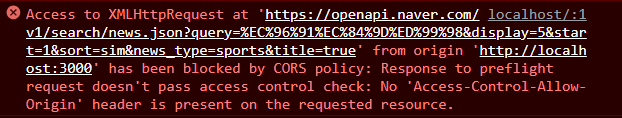
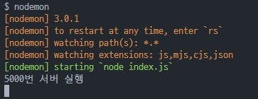
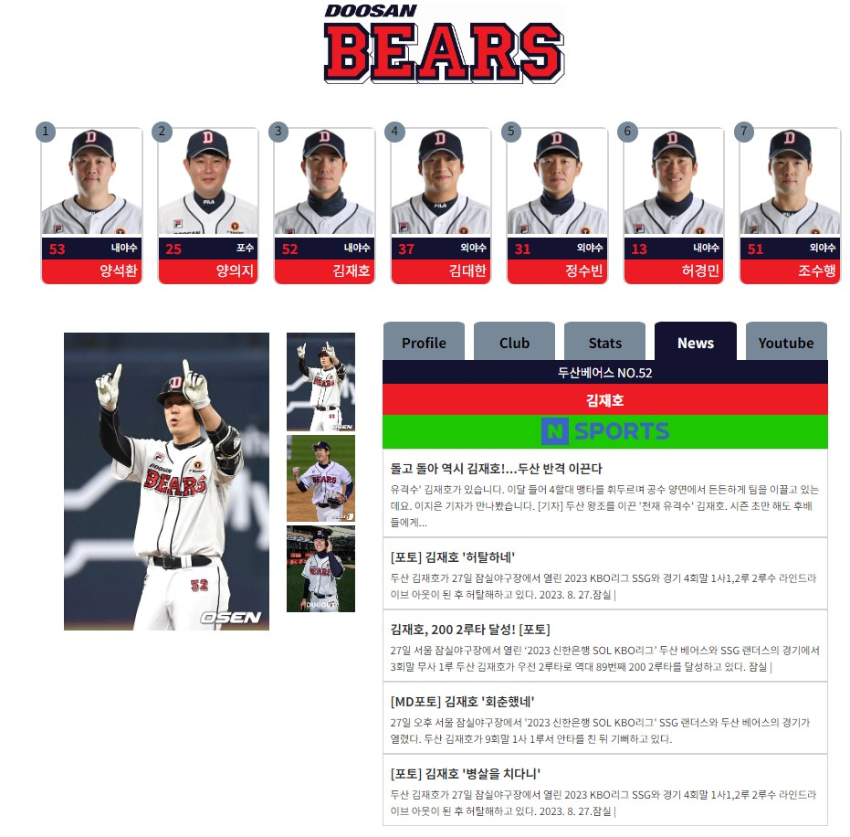

# PP-doosan_bears_node

## 두산 베어스 선수 정보 페이지 제작 (개인 프로젝트) + Node.js

[@기존 버전](https://github.com/yeonhub/PP-doosan_bears)

### 1) CORS 에러 발생

> #### 서로간의 공유(CORS)
>
> **원격 소스 공유** (Cross-Origin Resource Sharing, [CORS](https://developer.mozilla.org/ko/docs/Glossary/CORS) )는 추가 [HTTP](https://developer.mozilla.org/ko/docs/Glossary/HTTP) 헤더를 사용하고, 한 [소스](https://developer.mozilla.org/ko/docs/Glossary/Origin) 에서 실행 중인 웹 참여가 다른 소스를 거부할 수 있는 권한을 부여하도록 브라우저에 존재합니다. 웹 서버는 서버 자신의(도메인, 서버, 소스 포트)과 관련하여 HTTP 요청을 실행합니다.
>
> 특별 출처의 예시: `https://domain-a.com`의 프론트 엔드 JavaScript 코드를 [`XMLHttpRequest`](https://developer.mozilla.org/ko/docs/Web/API/XMLHttpRequest)사용하여 `https://domain-b.com/data.json`요청하는 경우.
>
> 보안 문제 때문에 브라우저에서 계속해서 HTTP 요청을 제한합니다. 예를 들어, `XMLHttpRequest`와 [Fetch API](https://developer.mozilla.org/ko/docs/Web/API/Fetch_API) 는 [동일하게 보호를](https://developer.mozilla.org/ko/docs/Web/Security/Same-origin_policy) 받으려면 들어갑니다. 즉, 이 API를 사용하는 웹사이트는 자신의 소스와 동일한 리소스만 불러올 수 있으며, 다른 소스의 리소스를 불러오려면 그 소스에서 올바른 CORS 헤더를 포함하여 응답을 반환해야 합니다.
>
> 출처 : https://developer.mozilla.org/ko/docs/Web/HTTP/CORS

CORS 에러의 발생 이유에 대해 검색해본 결과 한가지 예로 간단하게 정리할 수 있었다.

A에서 B로 API 요청했을 때 API를 호출하는 곳이 A가 아닌 AA일 때 문제가 발생한다.

여기에서 출처는 도메인, 프로토콜, 포트를 나타내며 이 3가지가 동일해야 같은 출처로 판단한다.

도움 글 : [https://escapefromcoding.tistory.com/724](https://escapefromcoding.tistory.com/724)



### 2) CORS 에러 해결 방법

출처를 동일하게 만들어 주기 위해 proxy를 설정하여 요청을 할 수 있다.

하지만 이 방법은 우회하는 일시적인 방법이므로 백엔드를 구축하여 CORS 에러를 해결했다.

```javascript
// package.json

"proxy":"https://openapi.naver.com"
```

### 3) 백엔드 추가

단순히 API호출만 백엔드에서 해주면 되기 때문에 node 파일 하나만 추가해 주었다.

```javascript
const express = require('express');
const axios = require('axios');

// CORS 문제 해결

const cors = require('cors');

require('dotenv').config();

const app = express();

// port 5000번

const port = 5000;

app.use(cors());

const NAVER_API_URL = 'https://openapi.naver.com/v1/search/news.json';

app.get('/news', async (req, res) => {
    const query = req.query.query;
    try {
        const response = await axios.get(NAVER_API_URL, {
            headers: {

                // API키 환경변수 관리

                'X-Naver-Client-Id': process.env.NAVER_API_CLIENT_ID,
                'X-Naver-Client-Secret': process.env.NAVER_API_CLIENT_SECRET,
            },
            params: {

                // 정확히 원하는 데이터를 받기 위해 params 작성

                query: query,
                display: 5,
                start: 1,
                sort: 'sim',
                news_type: 'sports',
                title: 'true',
            },
        });
        res.json(response.data);
    } catch (error) {
        console.error(error);
        res.status(500).json({ error: 'Internal Server Error' });
    }
});

app.listen(port, () => {
    console.log(`${port}번 서버 실행`);
});

```




